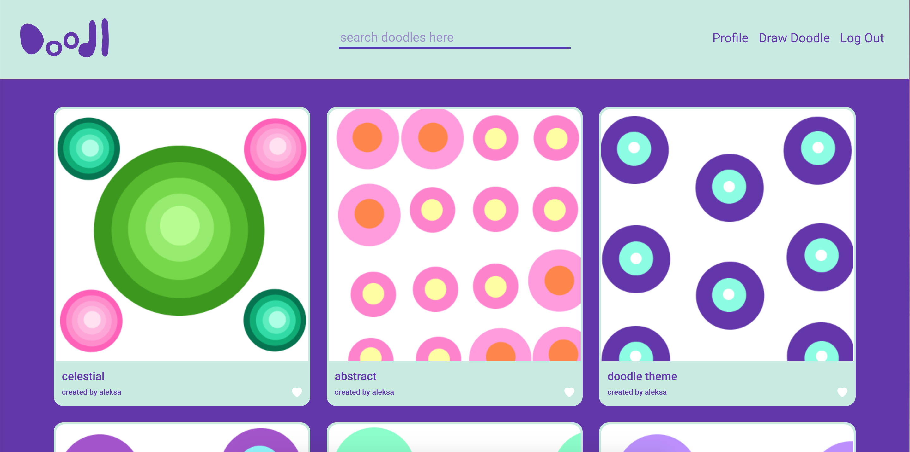

# Doodl #
by [Hyojin](https://github.com/jinnic) and [Aleksa](https://github.com/aleksarad) 💜

[Live @doodl.netlify.app](https://doodl.netlify.app/)   ID: Demo PW: Demo

<kbd>
    
</kbd>

### About ###

Doodl is a drawing app written in React with a Ruby on Rails backend. 

Doodl allows a user to:
* Sign up and create an account.
* Edit their account details.
* Create a doodle, edit doodles, and delete doodles.
* View and like the doodles of other users.
* Save doodles that they've created.
* Search through doodles by name.
* Remain auto logged in after sign-up/log-in.

### Built With ###
* [Frontend](https://github.com/aleksarad/doodl-frontend): React, Bootstrap, React Canvas Draw, Sass
* [Backend](https://github.com/jinnic/doodleApp-backend): Ruby On Rails, PostgreSQL, JWT, Serializer

### Features ###
* JWT Token Auth and auto login
* Embedded canvas for drawing and showing
* A fun and visually appealing custom design

### Resources used ###
* [Figma](https://www.figma.com/) - Creating mockups/prototypes for site layout and design
* [Trello](https://trello.com/) - Manage project and track progress
* [React-Canvas-Draw](https://github.com/embiem/react-canvas-draw) - A canvas drawing library for React
* [Bootstrap](https://getbootstrap.com/) - Modal and responsive grid structure
* [JWT](https://jwt.io/) - JSON Web Token for auto login

